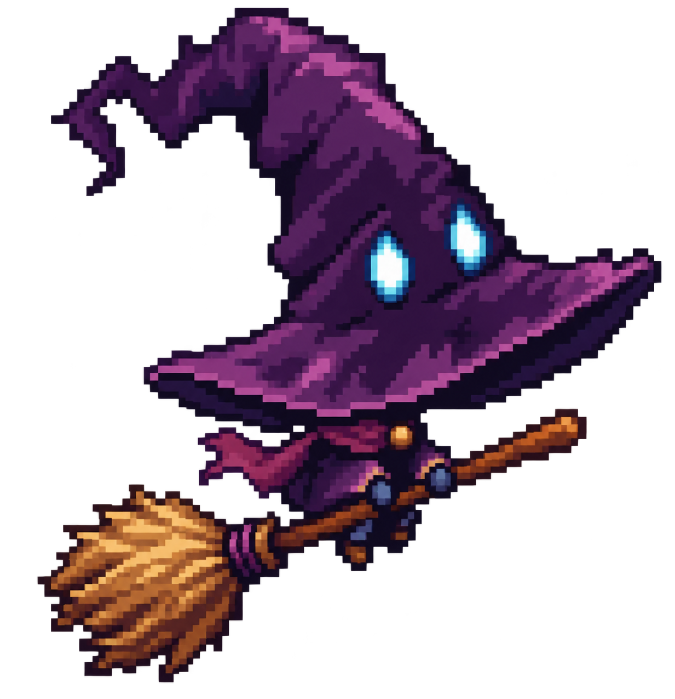

<!-- PYGINDEX:NAVIGATION START -->
[Zur Übersicht](README.md)
<!-- PYGINDEX:NAVIGATION END -->

# Ratgeber: beibehaltener Pixel-Art-Entwurf

- **Medientyp:** Pixel-Art-Charakterentwurf
- **Quelldatei:** nicht vorhanden; direkte Bildgenerierung
- **Exportdatei:** `guide-companion-variant-01.png`
- **Erstellungsdatum:** 2026-08-30
- **Konzept:** [Ratgeber im Heldenraum](../../concept/20-handlung/ratgeber-im-heldenraum.md)
- **Zweck:** Arbeitsrichtung für die weitere visuelle Ausarbeitung
- **Urheber- und Lizenzstatus:** mit der integrierten OpenAI-Bildgenerierung
  erzeugt; Produktions- und Rechtefreigabe sind noch offen

## Erhaltener Entwurf

Die Silhouette zeigt einen großen krummen Hut mit genau zwei sichtbaren Augen,
einen fast vollständig verdeckten winzigen Körper und einen Besen. Der Entwurf
ist weder fertiges Spritesheet noch verbindliche Farb- oder
Proportionsfestlegung.

Die ursprüngliche Serie enthielt vier Entwürfe. Nach der Sichtung blieb nur
diese Variante erhalten. Zusätzliche Bilddetails begründen keinen Kanon;
Animationen, Blickrichtungen und Lesbarkeit in echter Spielgröße müssen später
getrennt geprüft werden.
