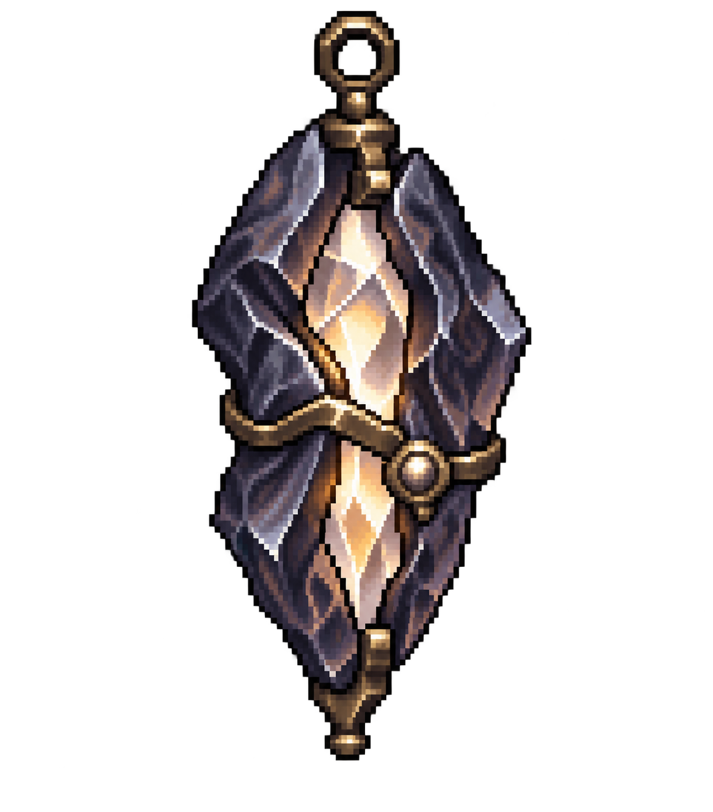

<!-- AUTO-GENERATED:backlink START -->
[← Back](images.md)
<!-- AUTO-GENERATED:backlink END -->
# Talisman: beibehaltener Pixel-Art-Entwurf

- **Medientyp:** Pixel-Art-Objektentwurf
- **Quelldatei:** Nicht vorhanden; direkte Bildgenerierung
- **Exportdatei:** `soul-talisman-variant-02.png`
- **Erstellungsdatum:** 2026-08-30
- **Zugehöriger Konzeptstand:**
  [Der Talisman, Version 0.1](../../content/de/02-story-and-world/soul-talisman.md)
- **Zweck:** Beibehaltener Entwurf für die weitere visuelle Ausarbeitung des
  zentralen Storyobjekts
- **Urheber- und Lizenzstatus:** Mit der integrierten OpenAI-Bildgenerierung
  erzeugte Konzeptentwürfe; Auswahl sowie Produktions- und Rechtefreigabe sind
  noch offen
- **Zugehörige Dokumente:**
  [Handlung und Welt](../../content/de/02-story-and-world/story-and-world.md),
  [Präsentationsrichtung](../../content/de/08-art-audio-and-ui/presentation-direction.md)

## Gemeinsame Vorgabe

Der Entwurf zeigt einen einzelnen Talisman als isoliertes
Pixel-Art-Objekt. Die Gestaltung soll Wichtigkeit, verborgenes Wissen und die
spätere Speicherung von Seelenmacht andeuten, ohne eine gefangene oder
vernichtete Seele darzustellen. Das Bild besitzt einen transparenten
Hintergrund und ist weder Produktionssprite noch verbindliche Festlegung
von Material, Farbe, Größe oder Trageweise.

## Variante 2 – Geteiltes Seelenprisma

Zwei dunkle Schalen umfassen einen hellen Kristall. Der Entwurf betont das
Bewahren von Kraft, ohne eine Seele als eingeschlossenes Wesen zu zeigen.

## Promptprotokoll

Die ursprüngliche Auswahlserie umfasste fünf getrennt erzeugte Formrichtungen:
Sichelbogen, geteiltes Prisma, offene Ringe, Keimgefäß und dunkler Spiegel.
Nach der Sichtung wurde das geteilte Prisma als Variante 2 beibehalten; die
vier übrigen Dateien gehören nicht mehr zum Dokumentationsstand. Alle Prompts
teilten diese Vorgaben: ein einzelnes Storyobjekt, handgezeichnet wirkende
Pixel-Art mit harten Kanten und begrenzter Palette, vollständige Silhouette,
transparenter Hintergrund, keine Schrift, keine lesbaren Runen, keine Figuren,
keine gefangenen Seelen, keine Waffe und kein Wasserzeichen.

## Grenzen

- Der beibehaltene Entwurf ist noch keine freigegebene Produktionsgestaltung.
- Zusätzliche Bilddetails begründen keinen Kanon.
- Die Darstellungen sind Konzeptbilder, keine maßstäblichen Inventaricons oder
  spielfertigen Sprites.
- Animation, Zustandswechsel, Leuchteffekte, UI-Größe und Sichtbarkeit in der
  Top-down-Perspektive müssen später getrennt entworfen und geprüft werden.
