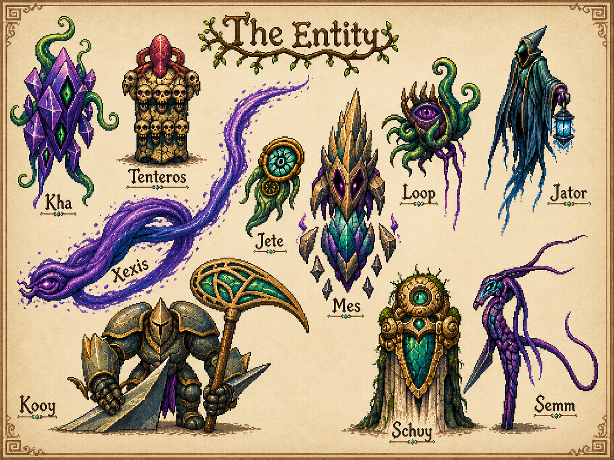

<!-- AUTO-GENERATED:backlink START -->
[← Back](40-fraktionen.md)
<!-- AUTO-GENERATED:backlink END -->
# Die zehn großen Ether-Entitäten

## Stellung

In Hera existieren unzählige Seelenwesen und Entitäten. Die folgende Zehnergruppe umfasst die mächtigsten bekannten Gegenspieler. Sie haben große Teile der Splittersphäre geprägt oder unter sich aufgeteilt. Die Liste bedeutet nicht, dass keine weiteren Entitäten existieren oder entstehen können.

## Bekannte Namen

| Name | Bisherige Rolle | Status |
|---|---|---|
| **Kha** | Große Entität; Funktion und Sphäre offen | Name bestätigt |
| **Tenteros** | Große Entität; auf der Sphärenkarte ebenfalls als Raum benannt | Name bestätigt |
| **Xexis** | Große Entität; auf der Sphärenkarte als riesige violette Sphäre dargestellt | Name bestätigt |
| **Jete** | Große Entität; Funktion offen | Name bestätigt |
| **Mes** | Große Entität; zentrale, kristallin gepanzerte Gestalt | Name bestätigt |
| **Loop** | Große Entität; vermutlich mit `Loop Hive 42` verbunden | Name bestätigt, Beziehung wahrscheinlich |
| **Jator** | Erbauer und Herr der Domäne Tatok; einer der beiden Hauptgegner des Basisspiels | Arbeitskanon |
| **Kooy** | Große, gerüstete Entität; Funktion offen | Name bestätigt |
| **Schuy** | Monumentale Entität; mögliche Beziehung zu `Schuk` offen | Name bestätigt |
| **Semm** | Mitverschwörer Jators und zweiter Endgegner des Basisspiels | Arbeitskanon |

## Gemeinsame Eigenschaften

- Sie gewinnen Macht aus Seelen und Seelenenergie.
- Sie können Pakte schließen und Seelenwege beeinflussen.
- Sie wirken auf Era vor allem indirekt, weil Sol und Yol den direkten Zugang blockieren.
- Ihre Körperdarstellungen sind Manifestationen und müssen nicht ihre einzige Form sein.
- Sie können besiegt, aber nicht endgültig getötet werden.
- Sie können bestehende Splitter beherrschen oder neue Wirklichkeitsräume erschaffen.

## Jator und Semm

Jator stellt die Konstruktwelt in seiner Domäne Tatok bereit. Semm wirkt am Plan zur Züchtung von Heldenseelen mit. Die genaue Arbeitsteilung ist noch offen. Als plausible Trennung bietet sich an, Jator stärker mit Raum, Gefängnis und Systemarchitektur zu verbinden und Semm stärker mit Seelenformung, Beobachtung oder Ernte; dies ist jedoch noch kein bestätigter Kanon.
