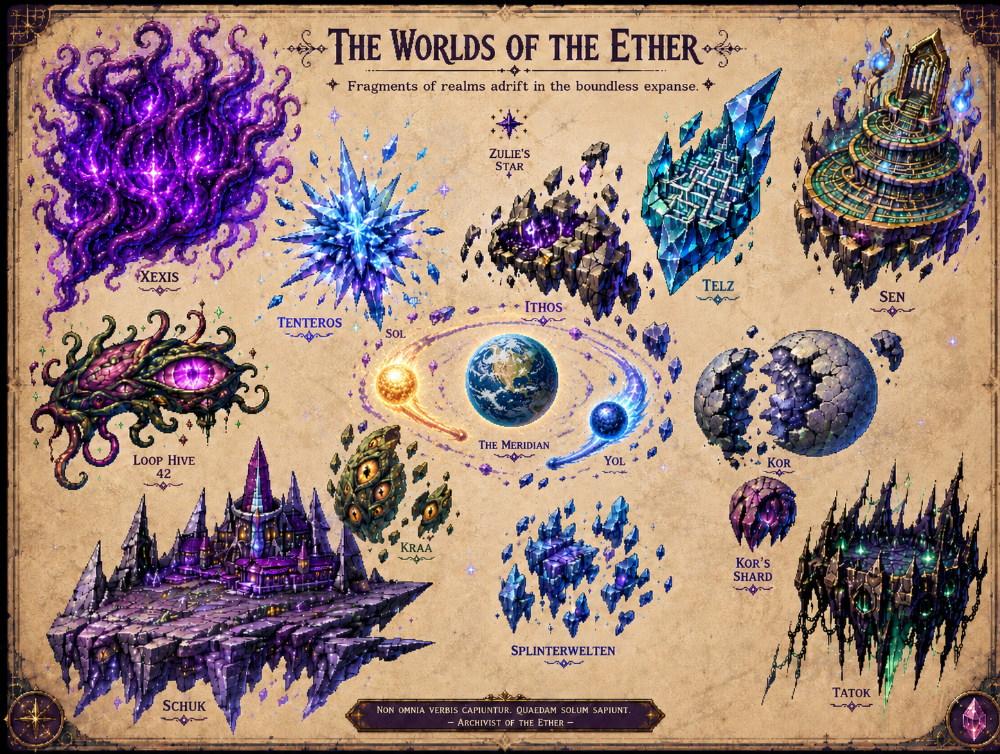

<!-- AUTO-GENERATED:backlink START -->
[← Back](20-geography-and-spheres.md)
<!-- AUTO-GENERATED:backlink END -->
# Concept Map – The Worlds of the Ether

## Visible Labels

The illustration contains the following names:

- Xexis
- Tenteros
- Zulie's Star
- Ithos
- Telz
- Sen
- Loop Hive 42
- Sol
- The Meridian
- Yol
- Kor
- Kraa
- Kor's Shard
- Splinterwelten
- Schuk
- Tatok

## Current Assessment

| Map Entry | Working Interpretation | Status |
|---|---|---|
| Sol | Era's source of life and warmth | confirmed |
| Yol | Era's pole of cold and magic | confirmed |
| The Meridian | Presumably Era or an older name for the central planet | open |
| Tatok | Jator's shard domain | highly likely |
| Splinterwelten | A group of freely drifting or broken fragments of reality | working version |
| Xexis | A sphere or manifestation of the entity Xexis | likely |
| Tenteros | A sphere or manifestation of the entity Tenteros | likely |
| Loop Hive 42 | A region, colony, or production sphere belonging to Loop | likely |
| Schuk | A large fortified shard city or domain; its relationship to Schuy remains unresolved | open |
| Kor / Kor's Shard | A world and a separated shard; the associated entity does not appear on the current list of ten | open |
| Ithos, Telz, Sen, Kraa | Additional shard spaces or centers of power | open |
| Zulie's Star | A star-like landmark or independent being | open |

## Canon Rule for the Illustration

The map is a strong visual foundation, but its labels become binding only after they have been confirmed in the written documentation. In particular, `The Meridian`, `Kor`, `Schuk`, `Ithos`, `Telz`, `Sen`, `Kraa`, and `Zulie's Star` still require clearly defined functions.
