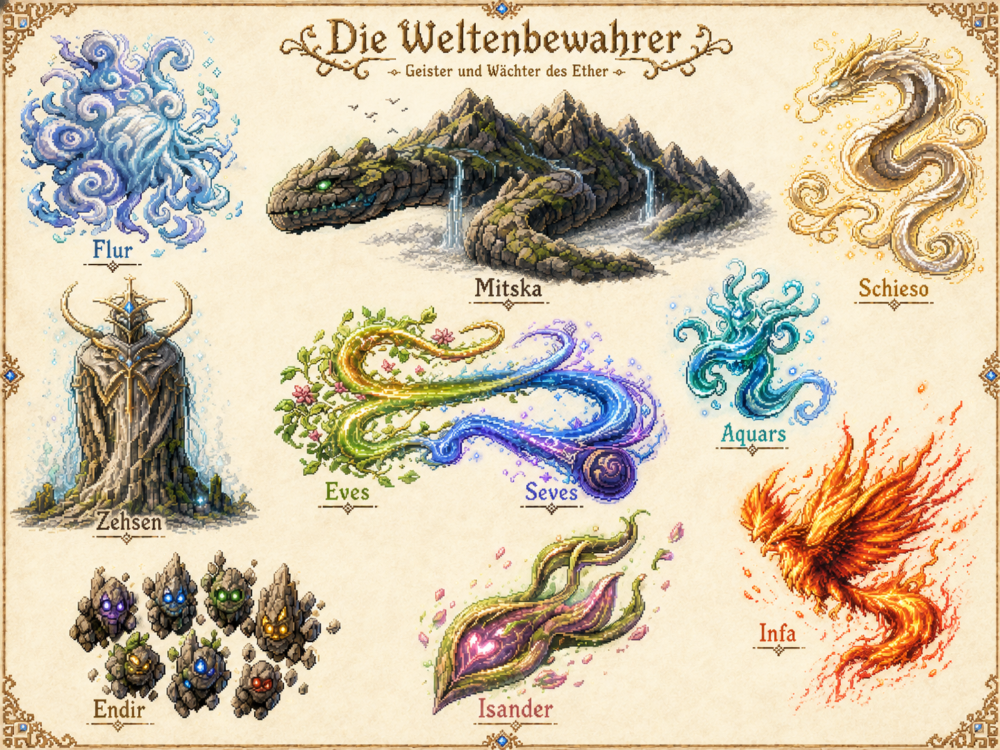

<!-- AUTO-GENERATED:backlink START -->
[← Back](40-factions.md)
<!-- AUTO-GENERATED:backlink END -->
# The Atea and the Worldkeepers

## Core Idea

The Atea are ten spirits and guardians of the Ether who are connected to Era itself. They are not merely external rulers, but embodiments of the world's forces, currents, and constituent parts. At the same time, they watch over and protect Era.

In a direct comparison of power, the major Ether Entities are stronger. Era's protection therefore does not rest on the Atea alone, but depends substantially on Sol and Yol.

## Known Atea

| Name | Function or Depiction Established So Far | Status |
|---|---|---|
| **Flur** | Air spirit; a form made of clouds and wind | confirmed |
| **Mitska** | Stone spirit in the form of an enormous stone serpent, as large as a mountain range; ridgelines resemble scales | confirmed |
| **Schieso** | A bright, dragon-like guardian form; exact domain unresolved | open |
| **Zehsen** | A monumental, bright, marble-like guardian who plants the Talisman within Jator's system | working canon |
| **Eves** | Current of life; green-gold, plant-like energy | confirmed |
| **Seves** | Current of mana; blue-violet magical energy | confirmed |
| **Aquars** | Water spirit | confirmed |
| **Infa** | Fire spirit | confirmed |
| **Endir** | A group of small rock and stone spirits | confirmed |
| **Isander** | An organic, plant-like or soul-like guardian form; exact function unresolved | open |

## Zehsen's Intervention

Zehsen recognizes or suspects the purpose of the Constructed World. Because an open attack on Tatok is either impossible or unlikely to succeed, Zehsen places a Talisman in the Hero's Chamber. The Talisman serves as a covert countermeasure within the system created by Jator and Semm.

## Open Questions

- Were the Atea created, or did they arise together with Era?
- Can they leave Era?
- How do they communicate with mortals and with one another?
- Why does Zehsen act alone or in secret?
- Which forces do Schieso and Isander represent exactly?
- Are Eves and Seves independent persons, conscious currents, or both at once?
