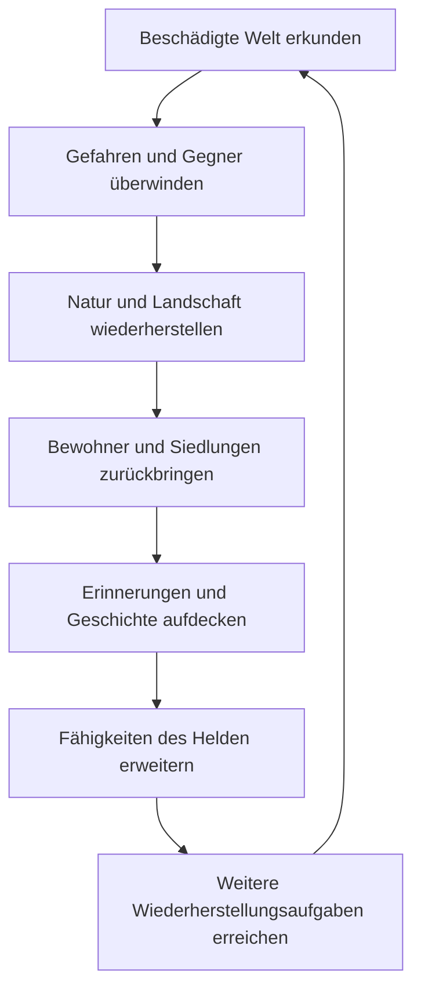

[← Überblick](index.md)

# Core Loop

## Zweck des Dokuments

Dieses Dokument visualisiert die bestätigte Grundstruktur des wiederkehrenden
Spielablaufs. Das Diagramm ist ein Arbeitsentwurf und noch keine freigegebene
Missions-, Ressourcen- oder Zustandsmaschine.

## Bestätigte Entscheidungen

Bestätigt sind Erkundung einer beschädigten Welt, das Überwinden von Gefahren
und Gegnern sowie die Reihenfolge von Landschaftswiederherstellung über die
Rückkehr von Bewohnern und Siedlungen bis zu Erinnerungen und erweiterten
Heldenfähigkeiten.

## Aktueller Arbeitsentwurf

Maschinen und Zuro sind nicht als Schritte eingetragen, weil ihre Bedeutung und
ihr Einfluss noch nicht entschieden sind.

## Spielerperspektive und Spielerfantasie

Der Spieler soll einen verständlichen Wechsel aus Erkunden, Bewältigen,
Wiederherstellen, Entdecken und Wachsen erleben. Noch nicht entschieden ist,
welcher Anteil der Spielzeit auf jeden Teil entfällt.

## Regeln und Ablauf

Das Diagramm beschreibt eine Makrofolge. Es entscheidet weder, ob einzelne
Schritte pro Gebiet wiederholt werden, noch ob Rücksprünge, optionale Aufgaben
oder parallele Ziele möglich sind. Diese Punkte müssen durch einen Prototyp
geprüft werden.

## Eingaben und Ausgaben

- Eingaben: erreichbare Gebiete, Gefahren, Gegner und noch zu definierende
  Wiederherstellungsbedingungen.
- Ausgaben: veränderte Landschaft, zurückkehrende Weltbestandteile,
  erschlossene Erinnerungen, Fähigkeiten und neue Aufgaben.
- Noch nicht entschieden: konkrete Ressourcen, Questdaten und Zustandswerte.

## Systemabhängigkeiten

Der Loop hängt von Landschaft, Kampf, Weltzustand, Bewohnern, Siedlungen,
Erinnerungen und Fortschritt ab. Maschinen, Zuro und Gegnerentwicklung sind
mögliche Einflussfaktoren, deren Anschlussstellen erst nach ihrer Definition
festgelegt werden dürfen.

## Veränderbare und später zu balancierende Werte

Zu prüfen sind Dauer, Häufigkeit, Abwechslung, Schwellen und Verhältnis der
Loop-Phasen. Es werden noch keine Zielzeiten oder Mengen festgelegt.

## Visuelles, akustisches und UI-Feedback

Der Übergang zwischen beschädigtem und wiederhergestelltem Zustand muss sichtbar
und verständlich sein. Audio- und UI-Signale sind noch nicht entschieden und
müssen die Weltveränderung ergänzen, nicht ersetzen.

## Sonderfälle und Risiken

- Erzwungene Linearität könnte Erkundung entwerten.
- Unklare Wiederherstellungsbedingungen könnten Fortschritt willkürlich wirken
  lassen.
- Zu spätes Feedback könnte Ursache und Wirkung trennen.
- Der Loop darf Maschinen oder Zuro nicht vor deren Freigabe voraussetzen.

## Offene Fragen

- Was gilt spielerisch als abgeschlossene Wiederherstellung eines Gebiets?
- Wie werden neue Aufgaben entdeckt oder freigeschaltet?
- Welche Schritte sind wiederholbar, optional oder unumkehrbar?
- Wie verbindet sich der Moment-zu-Moment-Kampf mit dem Makrofortschritt?

## Abnahmekriterien

- Ein Prototyp kann alle dargestellten Schritte in nachvollziehbarer Reihenfolge
  zeigen.
- Testpersonen können Ursache und Wirkung jeder Zustandsänderung beschreiben.
- Der Ablauf widerspricht keiner bestätigten Wiederherstellungsentscheidung.
- Maschinen und Zuro erscheinen erst nach eigener Freigabe als feste Faktoren.

## Verwandte Konzeptseiten

- [Gameplay und Fortschritt](../03-gameplay-and-progression/gameplay-and-progression.md)
- [Landschaftssystem](../07-landscape-and-environment/landscape-system.md)
- [Vertical Slice](../09-prototypes-and-tests/vertical-slice.md)
- [Designprinzipien](design-pillars.md)
