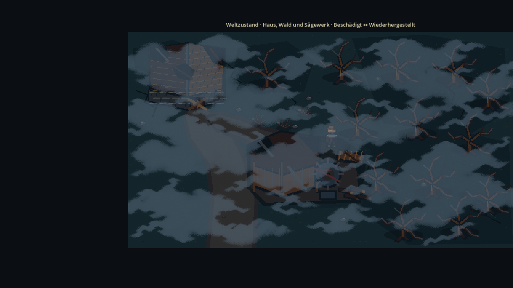
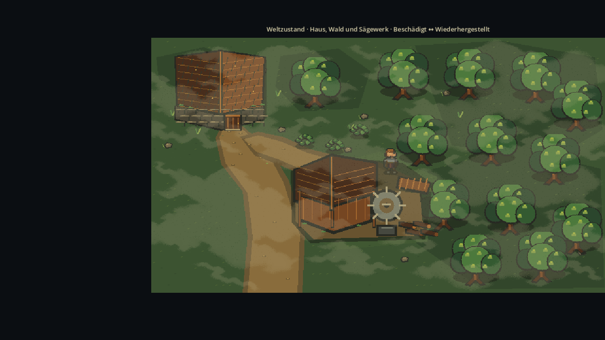

<!-- PYGINDEX:NAVIGATION START -->
[Zur Übersicht](index.md)
<!-- PYGINDEX:NAVIGATION END -->

# Visuelle Darstellungsgrundlage V0

## 1. Zweck und Geltungsbereich

Dieses Dokument bündelt die verbindlichen visuellen und technischen
Entscheidungen aus dem visuellen Testlabor. Es ist die gemeinsame
Darstellungsgrundlage für Figuren, Tilesets, Innen- und Außenbereiche,
Weltobjekte, Kamera und die ersten zusammenhängenden Pixelart-Grafiken.

Die gestalterische Quelle bleibt die
[visuelle Richtung V0](../../concept/60-produktion/visuelle-richtung-v0.md).
[ADR-0011](../../concept/entscheidungen/ADR-0011-massstab-v0.md) hält die
Maßstabsentscheidung fest. Diese Seite beschreibt deren technische Anwendung;
sie erzeugt keinen zweiten Konzeptkanon.

Laufzeitwerte wie FPS, momentane Positionen oder Fenstergröße sind
Diagnoseinformationen und keine Gestaltungsregeln.

## 2. Maßstab V0

Der angenommene Kandidat `B · Ausgewogen` heißt im Projekt `Maßstab V0`.

| Eigenschaft | Verbindlicher Wert |
|---|---|
| Heldenhöhe | 80 Weltpixel |
| Tilegröße | 32 × 32 Weltpixel |
| Standard-Zoom | 1,00× |
| Referenzauflösung | 1920 × 1080 |
| Seitenverhältnis | 16:9 |
| Pixel-Snap | aktiv |
| Texturfilter | Nearest-Neighbor für Pixelart |

Die Heldenhöhe entspricht 2,5 Tiles. Das Profil ist ein verbindlicher
Produktionsausgangspunkt, keine Zusage, dass einzelne Werte bis zur
Veröffentlichung niemals mehr überprüft werden dürfen.

## 3. Kamera und Skalierung

- `1,00×` ist der Standard für Welt, Dungeon und größere Spielbereiche.
- Kleine Innenräume dürfen über ihr Szenenprofil `1,50×` verwenden.
- Andere Settings dürfen später ein begründetes eigenes Szenenprofil erhalten.
- Schleichen überlagert das Szenenprofil sofort mit `1,50×`; danach wird das
  Szenenprofil wiederhergestellt.
- Das Testlabor bewahrt `0,75×`, `1,00×` und `1,50×` für Regressionen auf.
- Die getestete Kameraverfolgung verwendet kein Smoothing. Der sichtbare
  Kamerawert wird auf das gemeinsame Ausgabepixelraster gesetzt.
- Kameragrenzen bleiben logische Weltgrenzen und werden durch Pixel-Snap nicht
  verändert.

Ganzzahlige Fensterskalierung ist nicht vorgeschrieben. Auch nicht
ganzzahlige Skalierung ist erlaubt und wurde getestet. Die Spiellogik rundet
weder Spieler- noch Kameraziele: Nur das sichtbare Heldenbild und das sichtbare
Kameraziel werden auf Ausgabepixel ausgerichtet. Dadurch bleiben Bewegung,
Kollision und Weltkoordinaten unabhängig von der Darstellung.

Godot skaliert die logische 16:9-Ansicht gleichmäßig. Bei abweichenden
Fensterformaten bleibt das Seitenverhältnis erhalten; die ungenutzten Flächen
werden als schwarze Balken dargestellt. Der Weltbereich wird derzeit weder
erweitert noch beschnitten. Die Benutzeroberfläche bleibt innerhalb der
logischen 1920-×-1080-Ansicht positioniert.

## 4. Pixel-Snap

| Bereich | Einstellung |
|---|---|
| Spielfigur | aktiv am sichtbaren `Visual`; Physikkörper ungerundet |
| Kamera | aktiv am sichtbaren Kameraziel |
| Weltobjekte | gemeinsame Kamerarasterung; keine Einzelrundung |
| Tiles | gemeinsame Kamerarasterung; keine Einzelrundung |

Viewport-Transform-Snap, Vertex-Snap und Kamera-Smoothing bleiben aus. Eine
Einzelrundung verschachtelter Weltobjekte ist ausdrücklich nicht Teil der
Lösung. Die Rasterweite beträgt in Weltpixeln:

```text
1 / (Kamerazoom × Fensterskalierung)
```

Eine feste Viertelpixelphase verhindert wechselnde Rundungsentscheidungen an
numerischen Grenzwerten. Nearest-Neighbor erzeugt dabei keine weichen
Zwischenpixel.

### Testergebnis

- Im Stillstand bleiben Held und Weltmuster stabil.
- Horizontale, vertikale und diagonale Bewegung wurden geprüft.
- Kamera, Held, Tiles und feste Weltobjekte bleiben auf demselben sichtbaren
  Raster verankert.
- Bei nicht ganzzahliger Ausgabe können einzelne Pixel unterschiedlich breit
  erscheinen; das ist keine logische Positionsänderung.
- Die direkte Nachprüfung vom 3. September 2026 hat `1,00×` und `1,50×`
  bestätigt. Aufgabe 17.2 ist damit abgeschlossen.
- Die getrennte Bewegungssteuerung V0 aus Aufgabe 17.1 bleibt teilweise
  umgesetzt; ihr Status wird dadurch nicht vorweggenommen.

## 5. Texturfilter

- Standardfilter für Pixelart: `Nearest-Neighbor`.
- Getestete Alternative: weiche lineare Filterung.
- Bei `1,00×` erhält Nearest-Neighbor die klareren Konturen.
- Bei `1,50×` waren beide Filter in der getesteten ganzzahligen Ausgabe
  pixelgleich; der weiche Filter brachte keinen Vorteil.
- Bei `0,75×` bleibt Nearest-Neighbor schärfer, sehr feine Details können aber
  ausdünnen. Der weiche Filter lässt diese Details eher verschmelzen.
- Der Filter verändert weder Kamerafolge noch Bewegungskadenz.
- Nicht ganzzahlige Ausgabe ist zulässig; Pixel-Snap stabilisiert dabei die
  sichtbare Rasterphase.
- Bewusst weiche Atmosphären-, Licht-, Nebel- oder Magieeffekte dürfen später
  eine begründete Ausnahme bilden. Für Pixelart-Sprites und Tiles gilt
  weiterhin Nearest-Neighbor.

## 6. Nebel und Licht

Die Einstellungen sind bevorzugte V0-Testlaborprofile. Sie trennen die
Weltzustände deutlich, ohne eine endgültige Farbpalette oder finale
Grafik-Assets festzulegen.

### Beschädigter Weltzustand

| Eigenschaft | Gewählte Variante |
|---|---|
| Nebelstärke | Mittel |
| Helligkeit | Sehr dunkel |
| Kontrast | Mittel |
| Farbstimmung | Kühl und entsättigt |
| Lichtprofil | Kühl und dunkel |
| Sichtweite | eingeschränkt, mit freien Sichtlücken |
| Lesbarkeit | Held, Wege, Haus, Sägewerk und Wald bleiben erkennbar |



### Wiederhergestellter Weltzustand

| Eigenschaft | Gewählte Variante |
|---|---|
| Nebelstärke | Gering |
| Helligkeit | Hell |
| Kontrast | Hoch |
| Farbstimmung | Leicht warm |
| Lichtprofil | Warm und klar |
| Sichtweite | weitgehend frei |
| Lesbarkeit | Held, Wege, Gebäude, Sägewerk und Wald bleiben erkennbar |



### Technische Regeln

- Nebel besteht aus transparenten, wolkigen Texturlagen und nicht aus einer
  undurchsichtigen Farbfläche.
- Welt und Atmosphäre bleiben bei Kamerabewegung gemeinsam verankert.
- Ein Weltzustandswechsel stellt dessen getrennt gespeicherte Nebel- und
  Lichtauswahl wieder her.
- Beide bevorzugten Profile wurden bei `0,75×`, `1,00×` und `1,50×` geprüft.
- Unter Software-OpenGL lagen die 360-Frame-Messungen bei 64,20 FPS
  (beschädigt) und 61,66 FPS (wiederhergestellt).

Herkunft und Zweck der Aufnahmen sind in den
[Bildnachweisen](../../assets/images/visual-foundation-v0-references.md)
dokumentiert.

## 7. Größenverhältnisse

Nur tatsächlich abgenommene Regeln gelten als verbindlich:

| Objektart | Verbindliche Größenregel |
|---|---|
| Held | 80 Weltpixel hoch; Referenz für Figuren und Objekte |
| Türen | noch kein allgemeines Produktionsmaß beschlossen |
| Wände | noch kein allgemeines Produktionsmaß beschlossen |
| Wege | noch keine verbindliche Mindestbreite beschlossen |
| Möbel | noch keine verbindlichen Maße beschlossen |
| kleine Weltobjekte | müssen bei `1,00×` lesbar bleiben; Maß je Asset offen |
| große Hindernisse | dürfen mehrere Tiles umfassen; Maß je Asset offen |
| Interaktionsbereiche | technisch von der sichtbaren Grafik getrennt |
| Kollisionsflächen | folgen dem festen Boden- oder Hindernisbereich, nicht dem gesamten transparenten Sprite-Rechteck |

Das Testlabor verwendet aktuell unter anderem eine 84 × 112 Pixel große Tür,
eine 300 × 144 Pixel große Hauswand, einen 164 × 192 Pixel großen Baum sowie
kleine und große Gegnerreferenzen. Diese Maße sind geprüfte
Prototypvergleiche, aber keine allgemeinen Produktionsstandards.

Weltobjekte dürfen die 32er Tilegröße überschreiten. Ihre Bodenanker und
Kollisionsflächen müssen optisch nachvollziehbar bleiben. Ein Wechsel des
Maßstabsprofils darf weder Bewegung noch Kollision oder Interaktionslogik
verändern.

## 8. Referenzauflösung und Seitenverhältnis

- Logische Referenzauflösung: `1920 × 1080`.
- Verbindliches Seitenverhältnis: `16:9`.
- Standard-Fenstergröße im Entwicklungsprojekt: `1280 × 720`.
- Vollbild: dieselbe logische 16:9-Ansicht wird gleichmäßig skaliert.
- Skalierungsverfahren: Godot `canvas_items` mit Seitenverhältnis `keep`.
- Abweichende Formate: Letterbox- oder Pillarbox-Flächen statt Verzerrung.
- Zusätzliche Randflächen: derzeit schwarz; kein erweiterter Weltbereich.
- Benutzeroberfläche: bleibt innerhalb der logischen Referenzansicht; keine
  zusätzliche Breitbild-Neupositionierung ist beschlossen.

Die spätere Behandlung von 21:9 und 32:9 bleibt eine offene Stil- und
Spielbarkeitsfrage.

## 9. Testlabor-Preset

Name: `Maßstab V0`

| Einstellung | Wert |
|---|---|
| Heldenhöhe | 80 px |
| Tilegröße | 32 × 32 px |
| Kamera-Zoom | 1,00× |
| Referenzauflösung | 1920 × 1080 |
| Seitenverhältnis | 16:9 |
| Pixel-Snap | aktiv |
| Texturfilter | Nearest-Neighbor |
| beschädigtes Nebelprofil | Mittel |
| beschädigtes Lichtprofil | Kühl und dunkel |
| wiederhergestelltes Nebelprofil | Gering |
| wiederhergestelltes Lichtprofil | Warm und klar |

Die verbindlichen Maßstabswerte liegen in
`game/shared/resources/visual_baseline_v0.tres`. Im `F5`-Menü schaltet
`Maßstabsprofil` die Bündel `A → Maßstab V0 → C`; eine manuelle Abweichung
erscheint als `Freier Vergleich`.

Nebel und Licht sind nicht Teil der Maßstabsressource. Das Testlabor kombiniert
sie beim Start mit den Standardvarianten des jeweiligen Weltzustands und
speichert die gewählte Variante getrennt in
`user://visual_lab_settings.cfg`. Diese lokale Datei überlebt einen
Programmneustart, ist aber keine Quelle für Produktionsregeln.

Die Profile A und C, alternative Einzelwerte sowie `Freier Vergleich` bleiben
reine Testvarianten. Eine frische oder unvollständige Konfiguration verwendet
`Maßstab V0`.

## 10. Diagnoseanzeige

Die Diagnoseanzeige wird mit `F3` umgeschaltet und kann aktuell folgende
Werte zeigen:

- FPS,
- rohe Spielerposition und gerastertes Heldenbild,
- rohes und gerastertes Kameraziel sowie Kamerazentrum,
- Weltanker,
- Maßstabsprofil, Referenzauflösung und Seitenverhältnis,
- Kameraprofil, Kamera-Basis und aktiven Zoom,
- Bewegungs- und Sprungzustand,
- Figuren- und Tilegröße,
- Weltzustand, Nebel- und Lichtprofil,
- Pixel-Snap, Viewport-Transform-Snap und Vertex-Snap,
- Darstellungsraster und Rasterphase,
- Texturfilter,
- Fenstergröße und Fensterskalierung.

Kollisionsflächen werden separat mit `F4` eingeblendet. FPS, Koordinaten,
Fenstergröße, Rasterphase und ähnliche Laufzeitwerte sind ausschließlich
Diagnosewerte und keine Bestandteile des Maßstabs V0.

## 11. Entscheidungsstatus

### Verbindlich

- Heldenhöhe: 80 Weltpixel.
- Tilegröße: 32 × 32 Weltpixel.
- Standard-Zoom: 1,00×.
- kleine Innenräume: Szenenprofil 1,50× zulässig.
- Schleichzoom: 1,50×.
- Referenzauflösung und Seitenverhältnis: 1920 × 1080 bei 16:9.
- Pixel-Snap: aktiv über das gemeinsame Ausgabepixelraster.
- Pixelart-Texturfilter: Nearest-Neighbor.
- beschädigter V0-Testlaborstandard: Mittel, Kühl und dunkel.
- wiederhergestellter V0-Testlaborstandard: Gering, Warm und klar.

### Weiterhin experimentell

- alternative Heldenhöhen 64 und 96 Pixel,
- alternative Tilegrößen 48 und 64 Pixel,
- alternative Zoomstufen als allgemeine Spielansicht,
- weiche Filterung für Pixelart,
- übrige Nebel- und Lichtvarianten,
- endgültige Palette, Detailstufe und Produktionsassets,
- allgemeine Maße für Türen, Wände, Wege, Möbel und Weltobjekte,
- Breitbildverhalten jenseits von 16:9.

## 12. Bekannte Einschränkungen

- Die Prüfung erfolgte überwiegend im visuellen Testlabor und im frühen
  Heldenraum, nicht in fertigen Regionen.
- Das Profil `Kleiner Innenraum · experimentell` bestätigt die technische
  Möglichkeit von `1,50×`; die Zuordnung weiterer Räume erfolgt erst bei der
  Levelproduktion.
- Fertige NPC-, Gegner-, Gebäude- und Effektgrafiken existieren noch nicht in
  ausreichender Breite für eine endgültige Art-Bible.
- 21:9, 32:9 und verschiedene Geräteklassen sind noch nicht abgenommen.
- Die jetzigen Nebel- und Lichtfarben sind bevorzugte Prototypwerte, keine
  endgültige Farbpalette.
- Allgemeine Produktionsmaße jenseits von Held und Tile-Raster bleiben offen.

## 13. Testergebnisse

- Pixel-Snap: 288 OpenGL-Bewegungsaufnahmen für horizontal, vertikal und
  diagonal bei 1280 × 720 und 1920 × 1080 sowie `1,00×` und `1,50×`; zusätzlich
  160 verfolgte Ausschnitte für Held, Tiles und Weltobjekte. Direkter Sichttest
  am 3. September 2026 bestanden.
- Texturfilter: 124 OpenGL-Aufnahmen für alle drei Zoomstufen, Stillstand,
  Bewegung, Kamera, Boden, Referenzobjekte und beide Weltzustände ausgewertet.
- Nebel und Licht: 36 Variantenaufnahmen und 72 Bewegungsaufnahmen für beide
  Zustände, je drei Nebelstärken, zwei Lichtprofile und drei Zoomstufen; keine
  getrennt springende oder flackernde Atmosphärenlage.
- Maßstab: 54 Kombinationen aus Profil, Weltzustand, Heldenhöhe, Tilegröße und
  Zoom sowie Heldenraum, Kollision, Fenster und Vollbild geprüft.
- Bewegung, Kamera, Kollision und Ratgeber-Interaktion blieben durch die
  Darstellungsprofile unverändert.

Ausführliche Prüfprotokolle stehen in den Arbeitsplänen zu
[Pixel-Snap](../plans/visual-lab-pixel-snap.md),
[Texturfilter](../plans/visual-lab-texturfilter.md),
[Nebel und Licht](../plans/visual-lab-nebel-und-licht.md) und
[Maßstab V0](../plans/massstab-v0.md).

## 14. Freigabe für Grafikpaket V0

Maßstab, Raster, Standardkamera, Referenzansicht, Pixel-Snap und
Pixelart-Filter sind ausreichend definiert, um Aufgabe 22 –
`Pixelart-Grafikpaket V0` zu beginnen. Neue Grafiken müssen gegen den
80-px-Helden, das 32er Weltraster, die 16:9-Referenzansicht sowie `1,00×` und
zulässige `1,50×`-Szenenprofile geprüft werden.

Offene allgemeine Objektmaße werden pro Grafikpaket bewusst entschieden und
nicht aus den heutigen Prototypreferenzen abgeleitet.
