<!-- PYGINDEX:NAVIGATION START -->
[Zur Heldenübersicht](index.md) · [Zum Animationskatalog](../index.md)
<!-- PYGINDEX:NAVIGATION END -->

# Green Hero – Animationen

## Übersicht

| Eigenschaft | Wert |
|---|---|
| Typ | Held |
| ID | `green-hero` |
| Name | Green Hero |
| Kurzbeschreibung | Spielbarer grüner Held |
| Animationsstandard | 25 Animationstypen mit je 8 Richtungen |
| Aktuell dokumentiert | 7 Animationstypen; 6 davon vollständig in 8 Richtungen |
| Belegte Richtungsplätze | 49 von 200 |
| Dokumentierte GIFs | 51 |
| Frames je GIF | 6 bis 16 |
| Dokumentationsformat | GIF |
| Doku-Assets | `docs/assets/images/animations/heroes/green-hero/` |

## Kurzbeschreibung

Der Green Hero ist eine spielbare Heldenfigur von EtherFood. Diese Seite
dokumentiert ausschließlich die tatsächlich vorhandenen visuellen
GIF-Vorschauen der Figur. Stehen, langes Warten, Gehen, Laufen, Rennen und
Sprinten liegen in allen acht Richtungen vor. Genervtes Warten ist als
dreiteilige Folge nach Süden dokumentiert. Rennen und Sprinten verwenden
dieselben Bildfolgen mit unterschiedlichen Wiedergabegeschwindigkeiten.

Der vollständige Heldenstandard bleibt mit 25 Animationstypen sichtbar. Ein
Gedankenstrich (`—`) bedeutet, dass für diesen Richtungsplatz aktuell kein GIF in
der Dokumentation verfügbar ist. Er ist weder ein kaputter Bildlink noch eine
Aussage darüber, ob außerhalb dieses Dokumentationsbestands bereits weitere
Arbeiten existieren.

## Herkunft und Verwendung

| Merkmal | Angabe |
|---|---|
| Zweck | Öffentliche, releasegeeignete Vorschau und visuelle Referenz der vorhandenen Animationen |
| Herkunft | Fertige GIF-Exporte aus der lokal bereitgestellten Green-Hero-Arbeitsstruktur |
| Dokumentationsstand | 7. September 2026 |
| Spielstand | Green Hero; Stehen, langes Warten, Gehen, Laufen, Rennen und Sprinten vollständig; genervtes Warten nur nach Süden |
| Technische Merkmale | Alle GIFs mit 640 × 640 Pixeln; 35 GIFs mit 16 Frames; Rennen und Sprinten mit 6 Frames je Richtung, Südosten jeweils mit 8 Frames |
| Race-Wiedergabe | 12 Hundertstelsekunden je Frame, etwa 8,3 FPS |
| Sprint-Wiedergabe | 6 Hundertstelsekunden je Frame, etwa 16,7 FPS; exakt doppelte Bildrate von Rennen |
| Urheberschaft und Lizenzstatus | Ausgangsmotiv vom Benutzer bereitgestellt; die Übernahme der Vorschauen verändert dessen Nutzungsrechte nicht |

Die Arbeitsstruktur und ihre PNG-, Spritesheet- und Quelldateien bleiben lokal
und sind nicht Bestandteil dieser Referenz.

Aus acht vorhandenen Bildfolgen wurden zwei Geschwindigkeitsstufen aufbereitet.
Rennen behält die ursprüngliche Frameverzögerung von 12 Hundertstelsekunden;
Sprinten verwendet pixelgleiche Kopien mit 6 Hundertstelsekunden. Die passend
benannten Race- und Sprint-Spritesheets verbleiben in der lokalen
Arbeitsstruktur.

## Richtungen

Für richtungsabhängige Animationen gilt diese einheitliche Reihenfolge:

| Kürzel | Richtung |
|---|---|
| N | Norden |
| NE | Nordosten |
| E | Osten |
| SE | Südosten |
| S | Süden |
| SW | Südwesten |
| W | Westen |
| NW | Nordwesten |

## Animationsübersicht

### Idle

| Animation | N | NE | E | SE | S | SW | W | NW |
|---|---|---|---|---|---|---|---|---|
| Stehen |  |  |  |  |  |  |  |  |
| Lange warten |  |  |  |  |  |  |  |  |
| Genervtes Warten | — | — | — | — |  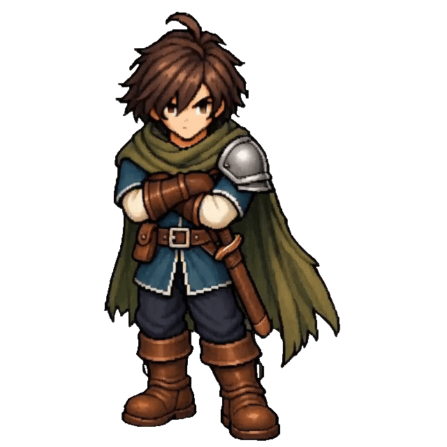 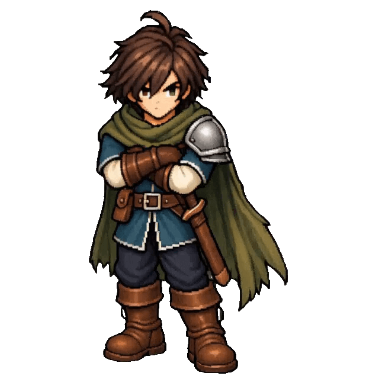 | — | — | — |

Die drei Teile des genervten Wartens bilden gemeinsam einen Animationstyp und
belegen gemeinsam den Richtungsplatz Süden. Jeder Teil besitzt 16 Frames; die
gesamte Folge umfasst damit 48 Frames und 5,76 Sekunden.

### Bewegung

| Animation | N | NE | E | SE | S | SW | W | NW |
|---|---|---|---|---|---|---|---|---|
| Gehen |  |  |  |  |  |  |  |  |
| Laufen | 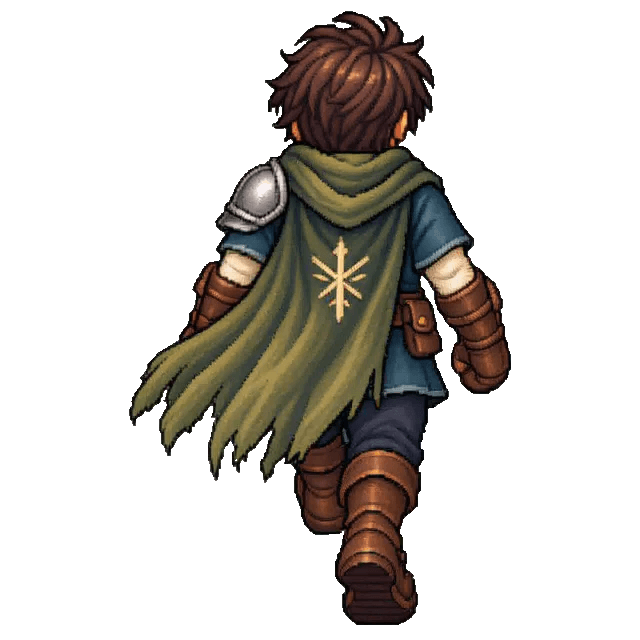 | 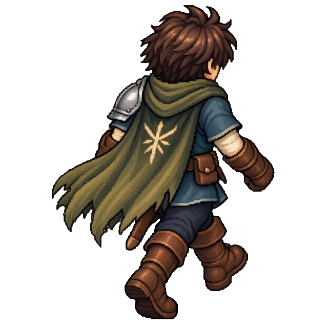 | 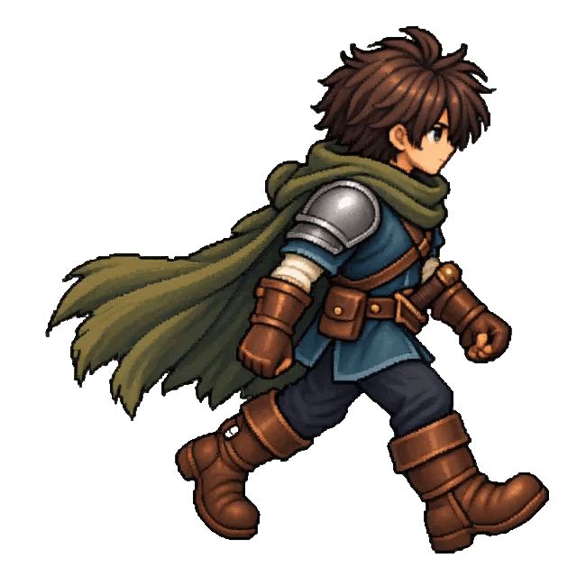 | 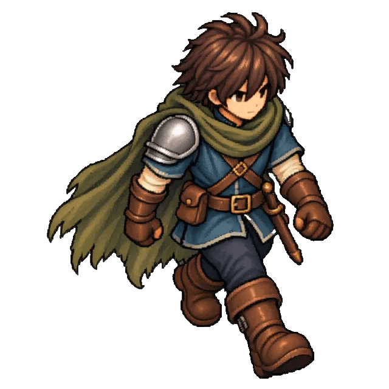 |  | 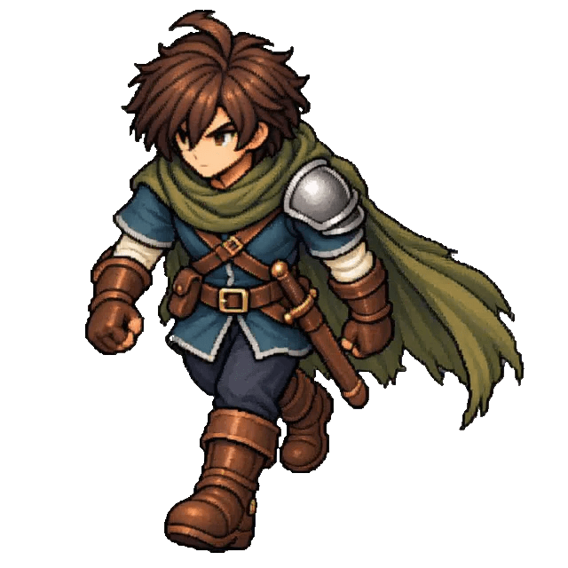 | 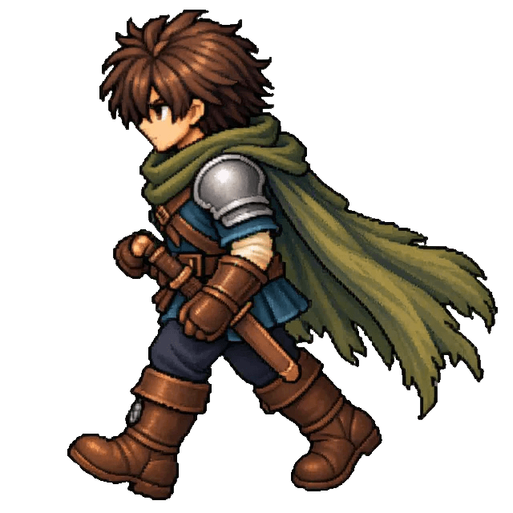 | 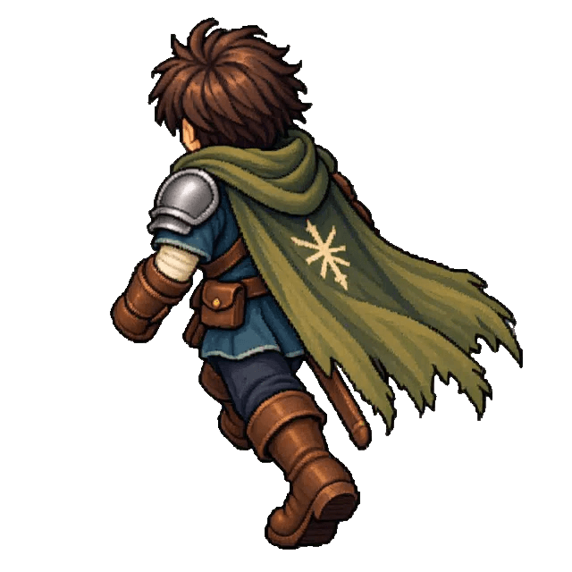 |
| Rennen | 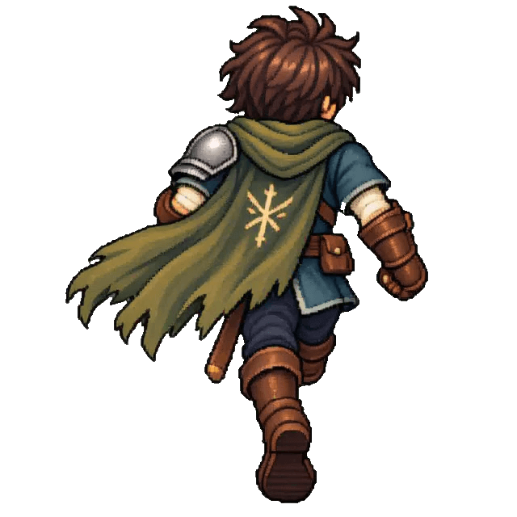 | 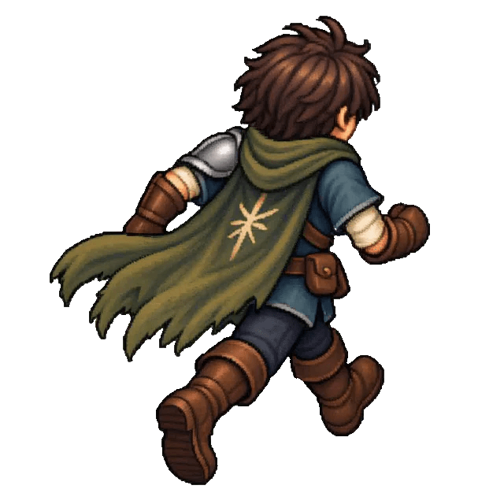 | 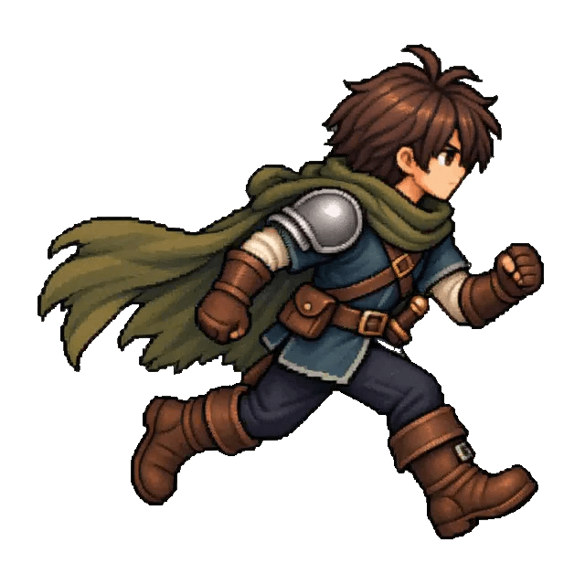 | 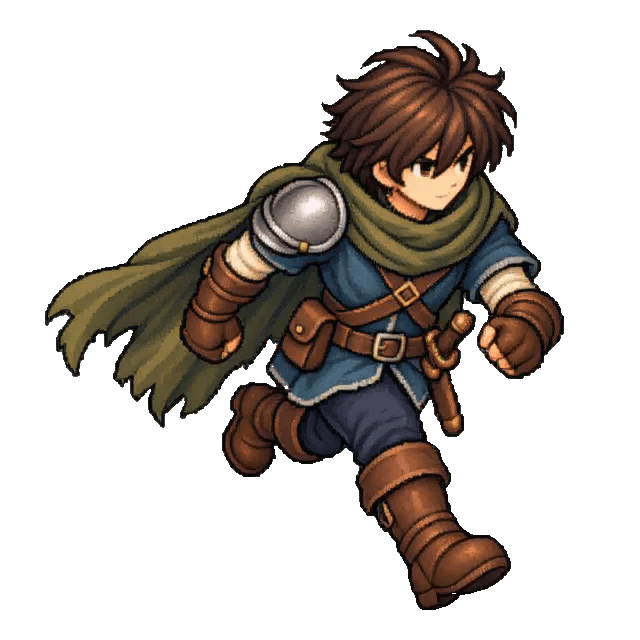 |  | 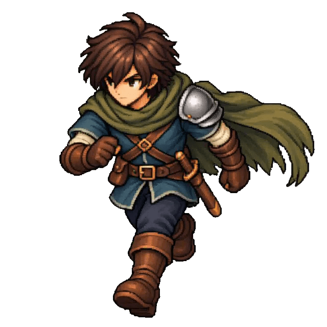 | 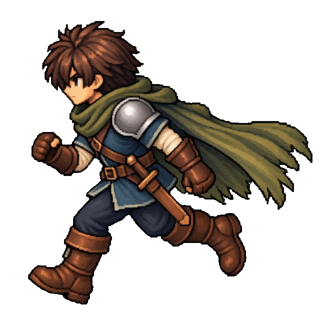 | 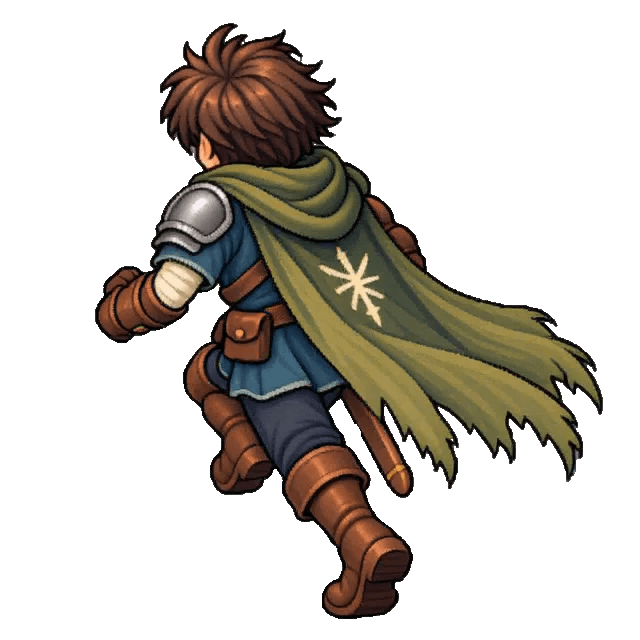 |
| Sprinten |  |  |  |  | 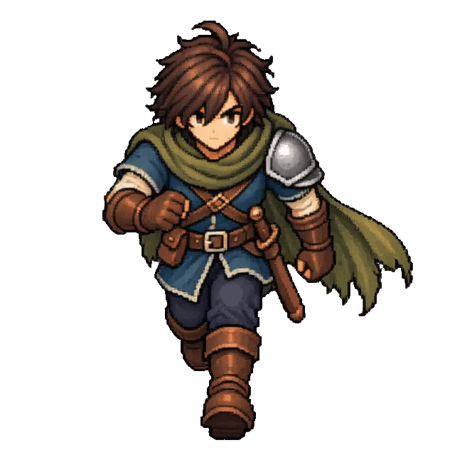 |  |  |  |

Rennen und Sprinten besitzen in sieben Richtungen je 6 Frames, in Südosten je
8 Frames. Die Race-GIFs laufen 0,72 beziehungsweise 0,96 Sekunden; die
pixelgleichen Sprint-GIFs laufen mit 0,36 beziehungsweise 0,48 Sekunden exakt
doppelt so schnell.

### Bewegungssprünge

| Animation | N | NE | E | SE | S | SW | W | NW |
|---|---|---|---|---|---|---|---|---|
| Gehsprung | — | — | — | — | — | — | — | — |
| Laufsprung | — | — | — | — | — | — | — | — |
| Rennsprung | — | — | — | — | — | — | — | — |
| Sprintsprung | — | — | — | — | — | — | — | — |

### Schleichen

| Animation | N | NE | E | SE | S | SW | W | NW |
|---|---|---|---|---|---|---|---|---|
| Schleichen | — | — | — | — | — | — | — | — |

### Angriffe

| Animation | N | NE | E | SE | S | SW | W | NW |
|---|---|---|---|---|---|---|---|---|
| Stehangriff | — | — | — | — | — | — | — | — |
| Schleichangriff | — | — | — | — | — | — | — | — |
| Gehangriff | — | — | — | — | — | — | — | — |
| Laufangriff | — | — | — | — | — | — | — | — |
| Rennangriff | — | — | — | — | — | — | — | — |
| Sprintangriff | — | — | — | — | — | — | — | — |

### Sprungangriffe

| Animation | N | NE | E | SE | S | SW | W | NW |
|---|---|---|---|---|---|---|---|---|
| Stehsprungangriff | — | — | — | — | — | — | — | — |
| Gehsprungangriff | — | — | — | — | — | — | — | — |
| Laufsprungangriff | — | — | — | — | — | — | — | — |
| Rennsprungangriff | — | — | — | — | — | — | — | — |
| Sprintsprungangriff | — | — | — | — | — | — | — | — |

### Ausweichen

| Animation | N | NE | E | SE | S | SW | W | NW |
|---|---|---|---|---|---|---|---|---|
| Schleichrolle | — | — | — | — | — | — | — | — |
| Ausweich-Backflip | — | — | — | — | — | — | — | — |

## Animationsdaten

| Kennzahl | Umfang |
|---|---:|
| Animationstypen im vollständigen Heldenstandard | 25 |
| Richtungen je Animationstyp | 8 |
| Richtungsplätze im vollständigen Standard | 200 |
| Frames je GIF | 6 bis 16 |
| Theoretischer Gesamtumfang des Standards | 3.200 Frames |
| Aktuell durch GIFs belegte Animationstypen | 7 |
| Davon vollständig in acht Richtungen | 6 |
| Aktuell belegte Richtungsplätze | 49 |
| Aktuell vorhandene GIF-Dateien | 51 |
| Aktuell in GIFs dokumentierter Umfang | 660 Frames |
| Derzeit ohne GIF-Vorschau | 151 Richtungsplätze |

Der theoretische Gesamtumfang beschreibt das einheitliche Raster eines
vollständigen Heldenanimationssatzes. Als tatsächlich vorhanden gelten auf
dieser Seite nur die 51 eingebetteten GIF-Dateien. Die drei Teile des genervten
Wartens zählen als ein Animationstyp und ein belegter Richtungsplatz, aber als
drei einzelne GIF-Dateien mit insgesamt 48 Frames. Race und Sprint steuern
jeweils 50 Frames bei; deshalb weicht der tatsächliche Umfang vom theoretischen
16-Frame-Raster ab.

## Dateisystem

Die Dokumentations-GIFs liegen unter:

`docs/assets/images/animations/heroes/green-hero/`

Das Schema lautet:

`<animation>/<direction>.gif`

Die vollständigen Richtungssätze liegen unter `stand/`, `stand-long/`, `walk/`,
`run/`, `race/` und `sprint/`. Die dreiteilige Vorschau des genervten Wartens
verwendet die Pfade `stand-very-long-1/`, `stand-very-long-2/` und
`stand-very-long-3/`. In jedem dieser Pfade liegt die vorhandene Richtung als
`s.gif`.

## Abgrenzung

Diese Seite dokumentiert nur die sichtbaren GIF-Vorschauen der fertigen
Animationen. Nicht Bestandteil dieser Dokumentation sind:

- PNG-Einzelframes,
- Arbeitsdateien,
- KI-Ausgangsbilder,
- Upscale-Dateien,
- Zwischenversionen,
- Spritesheets für Godot,
- Godot-Importdateien und
- lokale `.workspace`-Inhalte.

Spritesheets und Runtime-Animationen werden später getrennt in der
Godot-Struktur verwaltet. Wird eine dokumentierte Animation verbessert oder
ersetzt, wird ihr bestehendes GIF am gleichen Pfad aktualisiert; die
Referenzstruktur bleibt unverändert.
