<!-- PYGINDEX:NAVIGATION START -->
[Zur Heldenübersicht](index.md) · [Zum Animationskatalog](../index.md)
<!-- PYGINDEX:NAVIGATION END -->

# Green Hero – Animationen

## Übersicht

| Eigenschaft | Wert |
|---|---|
| Typ | Held |
| ID | `green-hero` |
| Name | Green Hero |
| Kurzbeschreibung | Spielbarer grüner Held |
| Animationsstandard | 25 Animationstypen mit je 8 Richtungen |
| Aktuell dokumentiert | 5 Animationstypen; 4 davon für alle 8 Richtungszustände |
| Belegte Richtungsplätze | 33 von 200 |
| Dokumentierte GIFs | 28 |
| Frames je GIF | 16 |
| Dokumentationsformat | GIF |
| Doku-Assets | `docs/assets/images/animations/heroes/green-hero/` |

## Kurzbeschreibung

Der Green Hero ist eine spielbare Heldenfigur von EtherFood. Diese Seite
dokumentiert ausschließlich die tatsächlich vorhandenen visuellen
GIF-Vorschauen der Figur. Stehen, langes Warten und Gehen liegen in allen acht
Richtungen vor. Beim genervten Warten wendet sich der Held unabhängig von
seiner vorherigen Richtung zur Kamera und schaut den inaktiven Spieler an. Die
dreiteilige Vorschau gilt deshalb für alle acht Richtungszustände. Rennen ist
bislang nur nach Süden dokumentiert.

Der vollständige Heldenstandard bleibt mit 25 Animationstypen sichtbar. Ein
Gedankenstrich (`—`) bedeutet, dass für diesen Richtungsplatz aktuell kein GIF in
der Dokumentation verfügbar ist. Er ist weder ein kaputter Bildlink noch eine
Aussage darüber, ob außerhalb dieses Dokumentationsbestands bereits weitere
Arbeiten existieren.

## Herkunft und Verwendung

| Merkmal | Angabe |
|---|---|
| Zweck | Öffentliche, releasegeeignete Vorschau und visuelle Referenz der vorhandenen Animationen |
| Herkunft | Fertige GIF-Exporte aus der lokal bereitgestellten Green-Hero-Arbeitsstruktur |
| Dokumentationsstand | 7. September 2026 |
| Spielstand | Green Hero; Stehen, langes Warten, genervtes Warten und Gehen vollständig; Rennen teilweise |
| Technische Merkmale | 28 GIFs mit je 640 × 640 Pixeln, 16 Frames und 1,92 Sekunden Laufzeit |
| Urheberschaft und Lizenzstatus | Ausgangsmotiv vom Benutzer bereitgestellt; die Übernahme der Vorschauen verändert dessen Nutzungsrechte nicht |

Die Arbeitsstruktur und ihre PNG-, Spritesheet- und Quelldateien bleiben lokal
und sind nicht Bestandteil dieser Referenz.

## Richtungen

Für richtungsabhängige Animationen gilt diese einheitliche Reihenfolge:

| Kürzel | Richtung |
|---|---|
| N | Norden |
| NE | Nordosten |
| E | Osten |
| SE | Südosten |
| S | Süden |
| SW | Südwesten |
| W | Westen |
| NW | Nordwesten |

Die Sonderdatei `all.gif` kennzeichnet eine bewusst richtungsunabhängige
Vorschau. Beim genervten Warten verwenden alle acht Richtungszustände dieselbe
zur Kamera gewandte Animation.

## Animationsübersicht

### Idle

| Animation | N | NE | E | SE | S | SW | W | NW |
|---|---|---|---|---|---|---|---|---|
| Stehen |  | 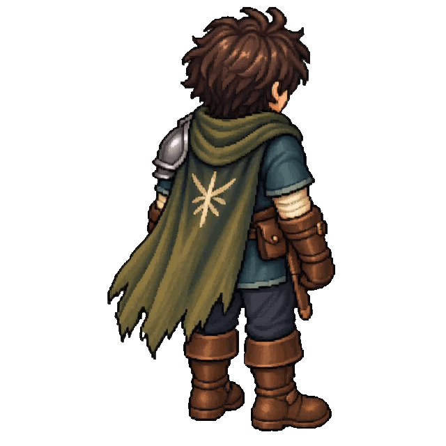 | 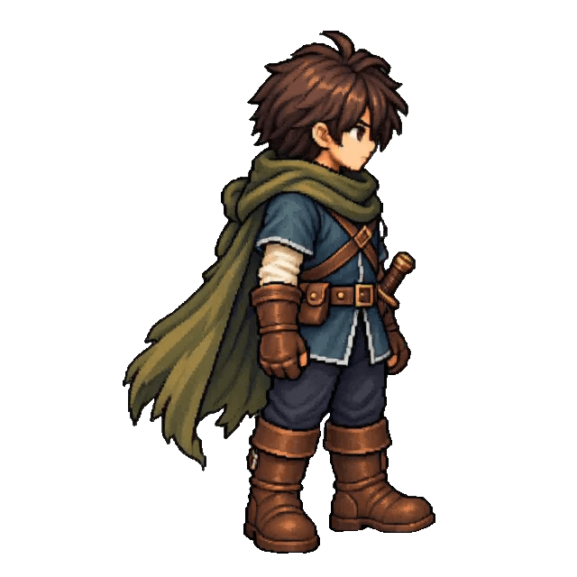 | 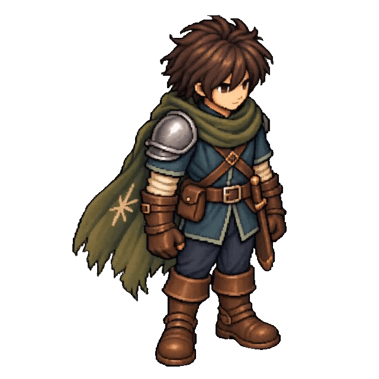 |  | 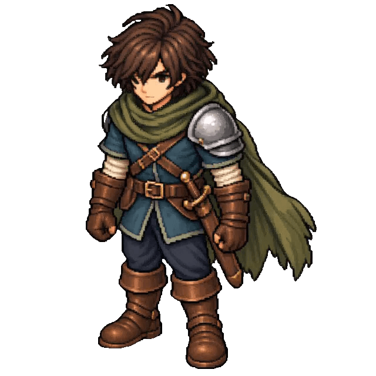 |  |  |
| Lange warten | 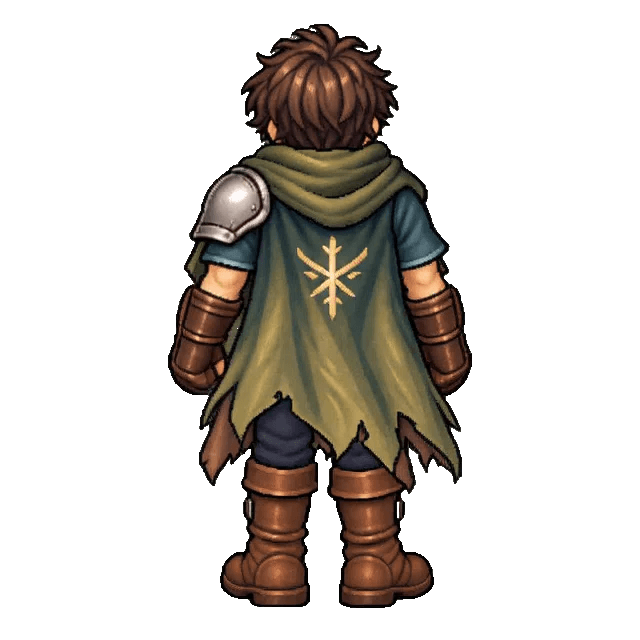 | 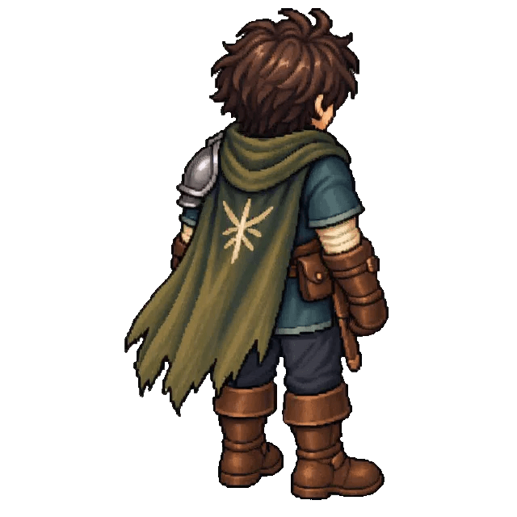 | 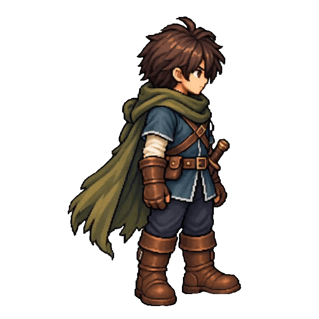 |  | 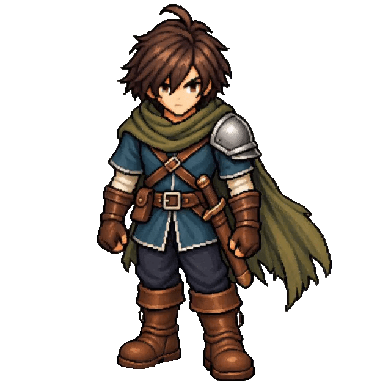 |  | 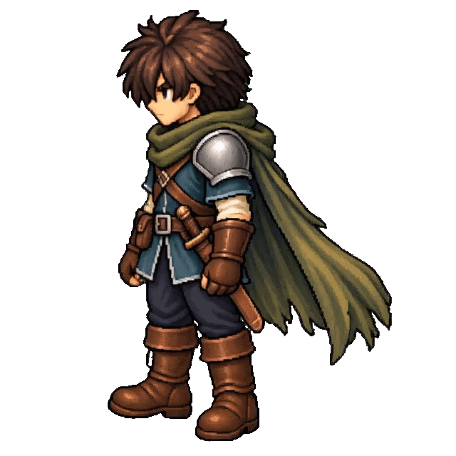 | 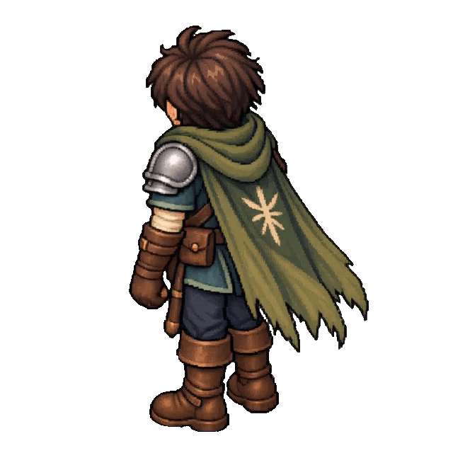 |
| Genervtes Warten | 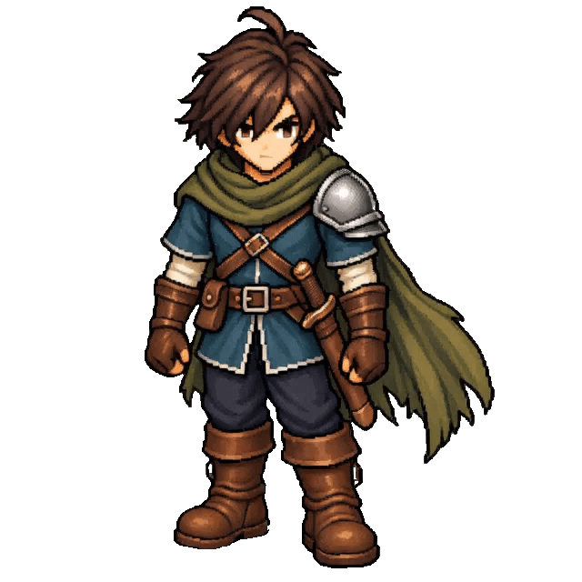   |    |    |    |    |    |    |    |

Die drei Teile des genervten Wartens bilden gemeinsam einen Animationstyp und
werden in jeder Richtung gemeinsam angezeigt. Die drei Dateien werden nur
einmal gespeichert. Jeder Teil besitzt 16 Frames; die gesamte Folge umfasst
damit 48 Frames und 5,76 Sekunden.

### Bewegung

| Animation | N | NE | E | SE | S | SW | W | NW |
|---|---|---|---|---|---|---|---|---|
| Gehen | 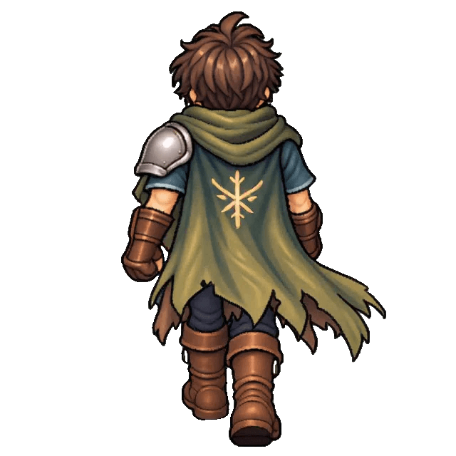 | 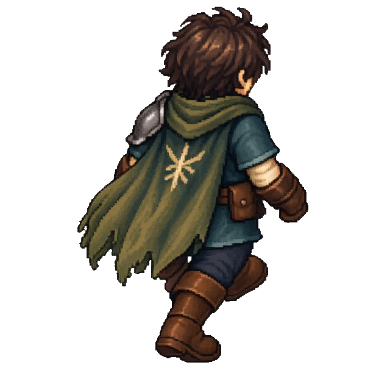 | 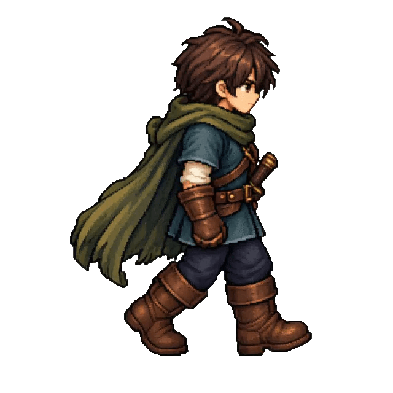 | 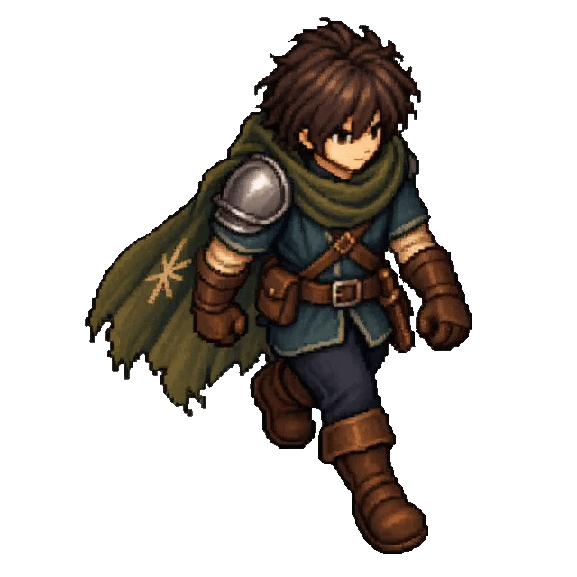 | 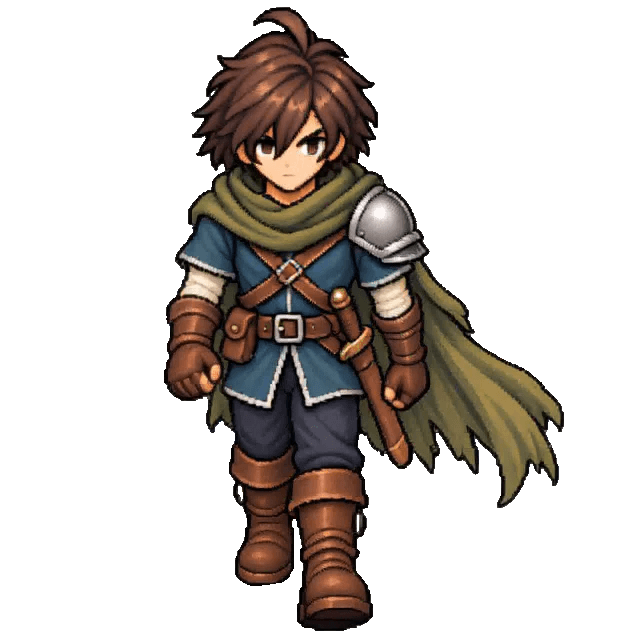 | 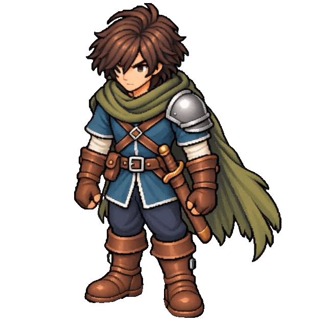 | 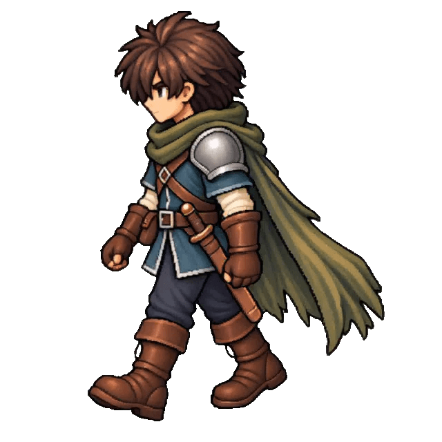 | 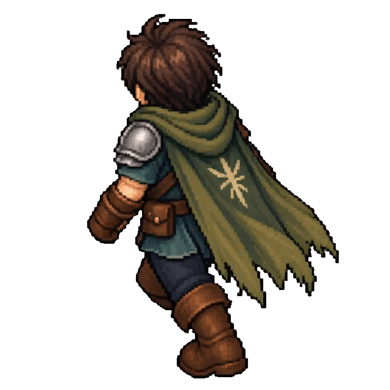 |
| Laufen | — | — | — | — | — | — | — | — |
| Rennen | — | — | — | — | 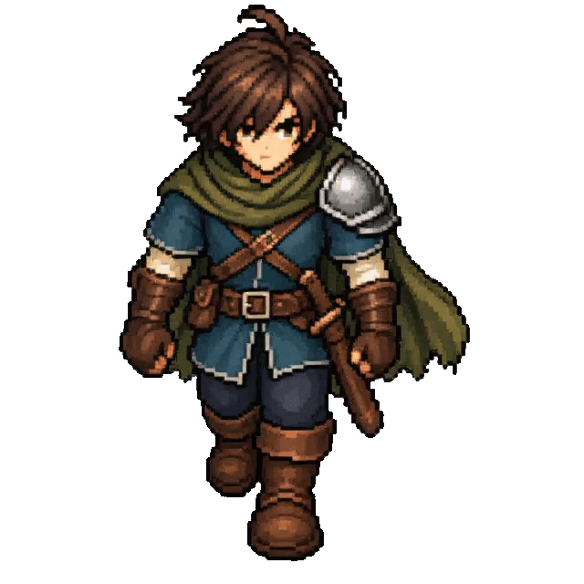 | — | — | — |
| Sprinten | — | — | — | — | — | — | — | — |

### Bewegungssprünge

| Animation | N | NE | E | SE | S | SW | W | NW |
|---|---|---|---|---|---|---|---|---|
| Gehsprung | — | — | — | — | — | — | — | — |
| Laufsprung | — | — | — | — | — | — | — | — |
| Rennsprung | — | — | — | — | — | — | — | — |
| Sprintsprung | — | — | — | — | — | — | — | — |

### Schleichen

| Animation | N | NE | E | SE | S | SW | W | NW |
|---|---|---|---|---|---|---|---|---|
| Schleichen | — | — | — | — | — | — | — | — |

### Angriffe

| Animation | N | NE | E | SE | S | SW | W | NW |
|---|---|---|---|---|---|---|---|---|
| Stehangriff | — | — | — | — | — | — | — | — |
| Schleichangriff | — | — | — | — | — | — | — | — |
| Gehangriff | — | — | — | — | — | — | — | — |
| Laufangriff | — | — | — | — | — | — | — | — |
| Rennangriff | — | — | — | — | — | — | — | — |
| Sprintangriff | — | — | — | — | — | — | — | — |

### Sprungangriffe

| Animation | N | NE | E | SE | S | SW | W | NW |
|---|---|---|---|---|---|---|---|---|
| Stehsprungangriff | — | — | — | — | — | — | — | — |
| Gehsprungangriff | — | — | — | — | — | — | — | — |
| Laufsprungangriff | — | — | — | — | — | — | — | — |
| Rennsprungangriff | — | — | — | — | — | — | — | — |
| Sprintsprungangriff | — | — | — | — | — | — | — | — |

### Ausweichen

| Animation | N | NE | E | SE | S | SW | W | NW |
|---|---|---|---|---|---|---|---|---|
| Schleichrolle | — | — | — | — | — | — | — | — |
| Ausweich-Backflip | — | — | — | — | — | — | — | — |

## Animationsdaten

| Kennzahl | Umfang |
|---|---:|
| Animationstypen im vollständigen Heldenstandard | 25 |
| Richtungen je Animationstyp | 8 |
| Richtungsplätze im vollständigen Standard | 200 |
| Frames je GIF | 16 |
| Theoretischer Gesamtumfang des Standards | 3.200 Frames |
| Aktuell durch GIFs belegte Animationstypen | 5 |
| Davon für alle acht Richtungszustände verfügbar | 4 |
| Aktuell belegte Richtungsplätze | 33 |
| Aktuell vorhandene GIF-Dateien | 28 |
| Aktuell in GIFs dokumentierter Umfang | 448 Frames |
| Derzeit ohne GIF-Vorschau | 167 Richtungsplätze |

Der theoretische Gesamtumfang beschreibt das einheitliche Raster eines
vollständigen Heldenanimationssatzes. Als tatsächlich vorhanden gelten auf
dieser Seite nur die 28 eingebetteten GIF-Dateien. Die drei Teile des genervten
Wartens zählen als ein Animationstyp und belegen durch ihre gemeinsame Nutzung
alle acht Richtungsplätze. Physisch bleiben es drei GIF-Dateien mit insgesamt
48 Frames.

## Dateisystem

Die Dokumentations-GIFs liegen unter:

`docs/assets/images/animations/heroes/green-hero/`

Das Schema lautet:

`<animation>/<direction>.gif`

Eine absichtlich richtungsunabhängige Animation verwendet stattdessen:

`<animation>/all.gif`

Die vollständigen Richtungssätze liegen unter `stand/`, `stand-long/` und
`walk/`. Von `run/` ist derzeit nur `run/s.gif` vorhanden. Die dreiteilige
Vorschau des genervten Wartens verwendet die Animationspfade
`stand-very-long-1/`, `stand-very-long-2/` und `stand-very-long-3/`. In jedem
dieser Pfade liegt die gemeinsam verwendete Vorschau als `all.gif`.

## Abgrenzung

Diese Seite dokumentiert nur die sichtbaren GIF-Vorschauen der fertigen
Animationen. Nicht Bestandteil dieser Dokumentation sind:

- PNG-Einzelframes,
- Arbeitsdateien,
- KI-Ausgangsbilder,
- Upscale-Dateien,
- Zwischenversionen,
- Spritesheets für Godot,
- Godot-Importdateien und
- lokale `.workspace`-Inhalte.

Spritesheets und Runtime-Animationen werden später getrennt in der
Godot-Struktur verwaltet. Wird eine dokumentierte Animation verbessert oder
ersetzt, wird ihr bestehendes GIF am gleichen Pfad aktualisiert; die
Referenzstruktur bleibt unverändert.
